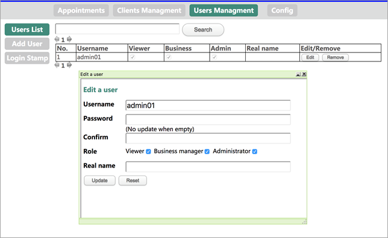
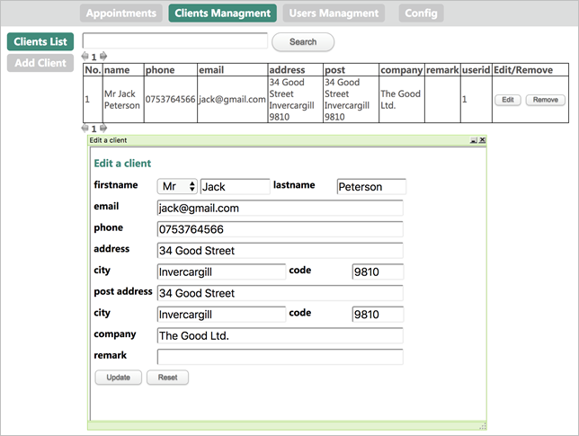
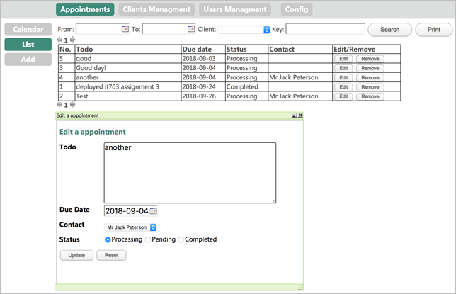
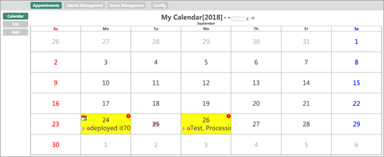

# minicrm
The MiniCRM is a customized light version CRM system developed with PHP. 
You can search user, client, appointment list and print it. 
It uses of Ftab and uuEdt and the source is included. 
Appointments can be shown in calendar format. 
 
Screen captures： 
 
 
 
 
